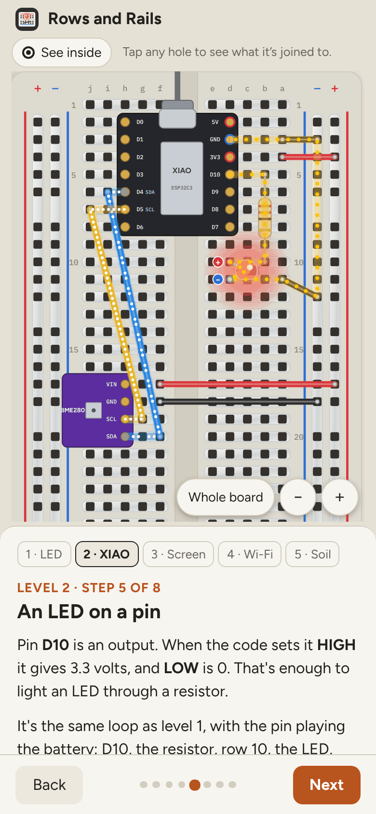
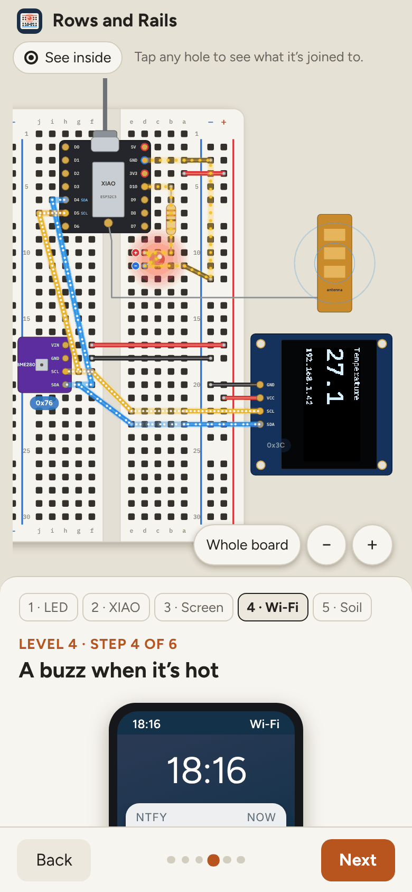
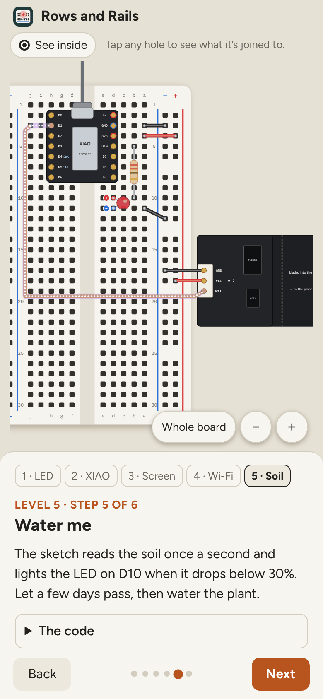
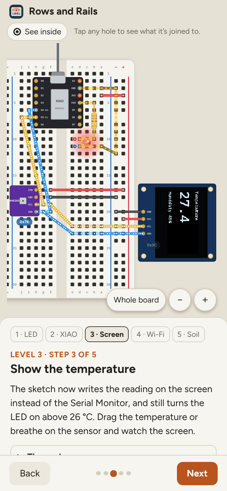

# Rows and Rails

**Use it: [rows-and-rails.junkdrawer.works](https://rows-and-rails.junkdrawer.works/)**

**A breadboard you can see inside.** Tap any hole to see which other holes it's joined to, switch the plastic to see-through to look at the metal clips underneath, then light an LED one part at a time with the current drawn flowing round the loop. It ends with the usual mistakes, a quick quiz and a board of your own to build on. Level 2 puts a XIAO ESP32C3 and a BME280 temperature sensor on the board: power from the XIAO, two I²C wires to the sensor, an LED on a pin, the Arduino sketch to run it, and a challenge to wire it all yourself. Level 3 adds a 0.96 inch OLED screen on the same two wires and turns it into a little weather station. Level 4 puts it on Wi-Fi: a page on your phone at weather.local, and a push alert through ntfy when it gets warm. Level 5 wires up a capacitive soil moisture sensor v1.2, calibrates it, and lights an LED when the plant wants water.

<p align="center">
  
  &nbsp;
  
  &nbsp;
  
  &nbsp;
  
  &nbsp;
  
  &nbsp;
  
</p>

## How it works

- **Level 1: twelve short steps.** Meet the board, look under the plastic, rows of five, the middle gap, the power rails, then build an LED circuit in four parts: power, resistor, LED, and the wire that closes the loop.
- **Level 2: a microcontroller and a sensor.** Eight steps with a Seeed Studio XIAO ESP32C3 (the S3 and C6 have the same pins) and a BME280 breakout. Wire 3V3 and GND to the rails, the sensor's SDA to D4 and SCL to D5, and an LED on D10. Moving dots show the messages on the I²C wires. **Run the code** has the real Arduino sketch to copy, a temperature to drag (or breathe on), a serial monitor, and the LED switching on above 26 °C. **Wire it yourself** starts with just the two boards and ticks off a checklist as you place each wire.
- **Level 3: a screen on the same two wires.** Five steps with an SSD1306 OLED. It's too wide for the board, so it sits above it on four jumper leads; two short jumpers put it on the sensor's SDA and SCL rows. Each device answers to its own address (0x76 and 0x3C). **Show the temperature** draws the sketch's real screen layout pixel by pixel as you drag the temperature, **Blank screen?** covers four reasons it stays dark, and **Wire the whole thing** is the final challenge.
- **Level 4: Wi-Fi.** Six steps and no new wires. Clip on the antenna, join a 2.4 GHz network, then send the readings two ways: a web page the XIAO serves at `weather.local` to a phone on the same Wi-Fi, and a push alert through [ntfy](https://ntfy.sh) that reaches your phone anywhere, once each time it warms past 26 °C. A phone beside the board shows both as you drag the temperature, two diagrams show the route each one takes, and **Can't connect?** covers six real causes, from a 5 GHz network to a topic nobody's subscribed to.
- **Level 5: a soil sensor.** Six steps with a capacitive soil moisture sensor v1.2 (GND, VCC, AOUT). How it senses, what a good board looks like (a TLC555 chip and a 662K regulator), power from 3V3, and why AOUT goes to D1: an analog pin with no other job, unlike D0 (checked at power-up) and D3 (stops working with Wi-Fi). The lead goes around the XIAO into D1's strip. **Calibrate it** takes your own dry-air and water readings, **Water me** has a plant that dries out and an LED that asks for water below 30%, and **Readings look wrong?** goes by what the Serial Monitor shows.
- **Tap any hole.** Every hole on the same clip lights up, and the line above the board names them.
- **See inside.** Fades the plastic so the metal clips show. Some steps turn it on for you.
- **A real check, not a picture.** Every circuit on the board goes through a small circuit checker (`js/circuit.js`). It finds each loop from the battery's + (or the XIAO's 3V3 and D10 pins) back to −, knows an LED only passes current one way, and catches the usual faults: LED backwards, both legs on one clip, an open loop, no resistor (the LED burns out), and a short circuit.
- **Why won't it light?** Six common mistakes, each with a "Show the fix" button.
- **Find a connected hole.** Six rounds: one hole glows and you tap another on the same clip.
- **Build your own.** Place wires, resistors and LEDs by tapping two holes. It tells you whether the LED lights, and why not if it doesn't. Your build is kept in this browser.
- **Fits the screen.** The board lies on its side on a wide screen and stands up on a phone, where the words follow it: the rails are "top and bottom" one way and "left and right" the other.
- **Zoom.** On a phone each step opens zoomed in on the part that matters. Pinch, drag, or use the + and − buttons; **Whole board** zooms back out.
- **LED legs are labelled.** The LED leans to one side so both holes stay in sight, with a red + on the long leg and a blue − on the short one. Tap a hole to hear what's plugged into it.
- No account and no server. It works offline and installs to a phone's home screen.

## Running it

It's a static site: plain HTML, CSS and JavaScript, with no build step.

```sh
npx serve .                   # or any static file server, then open the printed address
npm test                      # the circuit checker's unit tests, then the whole page in Chromium (needs Playwright)
node tools/screenshots.mjs    # redraws docs/*.png and og.png (Pillow shrinks them, if it's there)
node tools/make-icons.mjs     # redraws the PNG icons from icon.svg
node tools/build.mjs          # one self-contained file, dist/artifact.html, for sharing as a single page
```

To put it online with GitHub Pages: **Settings → Pages → Build and deployment → Deploy from a branch**, then pick `main` and `/ (root)`.

### Files

- `js/board.js`: where every hole is and which holes share a clip.
- `js/circuit.js`: the circuit checker: loops, LED direction, burn-outs and shorts.
- `js/render.js`: draws the board, the clips and the parts as SVG, either way up.
- `js/lessons.js`: what each step shows and says, and the six mistakes.
- `js/app.js`: steps, tapping holes, the quiz and the build-your-own board.
- `test/circuit.test.mjs`, `test/e2e.mjs`: the tests.
- `fonts/`: Figtree and IBM Plex Mono (SIL Open Font License), served from here so nothing loads from elsewhere.
- `sw.js`: keeps a copy for using offline.
- `carry.js`: brings a saved build over from the old address, junkdrawer.works/rows-and-rails, the first time it opens here.
- `CNAME`: its own address, rows-and-rails.junkdrawer.works, so it installs as an app of its own.
