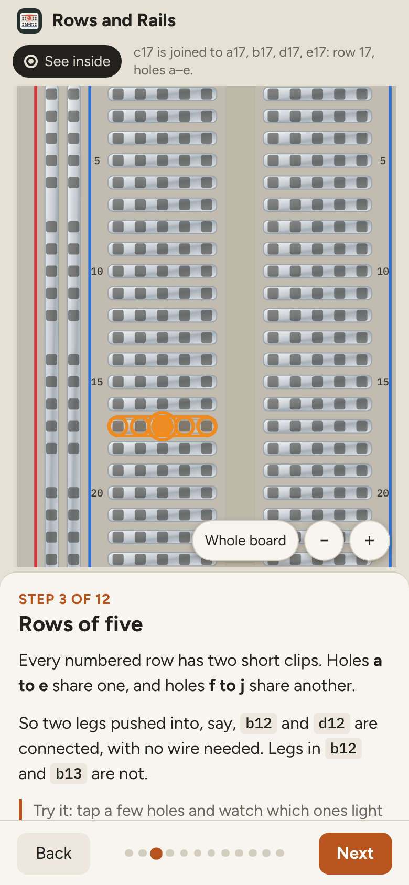
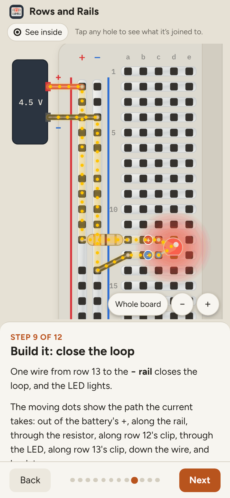
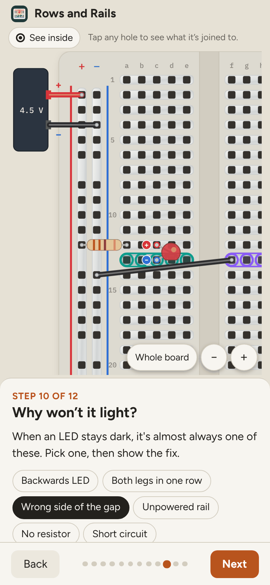

# Rows and Rails

**Use it: [junkdrawer.works/rows-and-rails](https://junkdrawer.works/rows-and-rails/)**

**A breadboard you can see inside.** Tap any hole to see which other holes it's joined to, switch the plastic to see-through to look at the metal clips underneath, then light an LED one part at a time with the current drawn flowing round the loop. It ends with the usual mistakes, a quick quiz and a board of your own to build on.

<p align="center">
  
  &nbsp;
  
  &nbsp;
  
</p>

## How it works

- **Twelve short steps.** Meet the board, look under the plastic, rows of five, the middle gap, the power rails, then build an LED circuit in four parts: power, resistor, LED, and the wire that closes the loop.
- **Tap any hole.** Every hole on the same clip lights up, and the line above the board names them.
- **See inside.** Fades the plastic so the metal clips show. Some steps turn it on for you.
- **A real check, not a picture.** Every circuit on the board goes through a small circuit checker (`js/circuit.js`). It finds each loop from the battery's + back to −, knows an LED only passes current one way, and catches the usual faults: LED backwards, both legs on one clip, an open loop, no resistor (the LED burns out), and a short circuit.
- **Why won't it light?** Six common mistakes, each with a "Show the fix" button.
- **Find a connected hole.** Six rounds: one hole glows and you tap another on the same clip.
- **Build your own.** Place wires, resistors and LEDs by tapping two holes. It tells you whether the LED lights, and why not if it doesn't. Your build is kept in this browser.
- **Fits the screen.** The board lies on its side on a wide screen and stands up on a phone, where the words follow it: the rails are "top and bottom" one way and "left and right" the other.
- **Zoom.** On a phone each step opens zoomed in on the part that matters. Pinch, drag, or use the + and − buttons; **Whole board** zooms back out.
- **LED legs are labelled.** The LED leans to one side so both holes stay in sight, with a red + on the long leg and a blue − on the short one. Tap a hole to hear what's plugged into it.
- No account and no server. It works offline and installs to a phone's home screen.

## Running it

It's a static site: plain HTML, CSS and JavaScript, with no build step.

```sh
npx serve .                   # or any static file server, then open the printed address
npm test                      # the circuit checker's unit tests, then the whole page in Chromium (needs Playwright)
node tools/screenshots.mjs    # redraws docs/*.png and og.png
node tools/make-icons.mjs     # redraws the PNG icons from icon.svg
node tools/build.mjs          # one self-contained file, dist/artifact.html, for sharing as a single page
```

To put it online with GitHub Pages: **Settings → Pages → Build and deployment → Deploy from a branch**, then pick `main` and `/ (root)`.

### Files

- `js/board.js`: where every hole is and which holes share a clip.
- `js/circuit.js`: the circuit checker: loops, LED direction, burn-outs and shorts.
- `js/render.js`: draws the board, the clips and the parts as SVG, either way up.
- `js/lessons.js`: what each step shows and says, and the six mistakes.
- `js/app.js`: steps, tapping holes, the quiz and the build-your-own board.
- `test/circuit.test.mjs`, `test/e2e.mjs`: the tests.
- `fonts/`: Figtree and IBM Plex Mono (SIL Open Font License), served from here so nothing loads from elsewhere.
- `sw.js`: keeps a copy for using offline.
